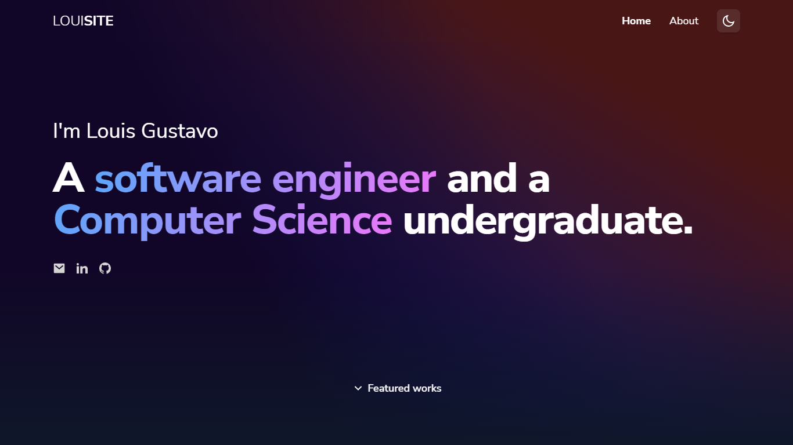

# LOUISITE

[](https://app.netlify.com/sites/louisite/deploys)

**LOUISITE** (stylized as LOUI**SITE**, a portmanteau of _Louis_ and _site_) is my personal website—this is the second iteration—showcasing my accomplishments. This website was built with [Tailwind CSS](https://tailwindcss.com/), [React](https://reactjs.org/), and [TypeScript](https://www.typescriptlang.org/).

[Visit the website here](https://louisite.netlify.app/)



## Overview

### Background

As an undergraduate looking for opportunities, I realized that I needed to build a visually appealing personal website to showcase my accomplishments and to provide hiring managers with a better idea of who I am.

### The problem

[The first iteration](https://github.com/itslouisgs/louisite-v1) failed to highlight my featured projects, the most important aspect of this website, due to other sections—to name a few, my experience, educational background, and my skills—taking precedence over the works section. In addition, I was personally not satisfied with the first iteration’s appearance. This prompted me to develop the second iteration with an all-new and refreshed layout and appearance.

### A solution

To prevent stuff from bloating the single index page, I decided to build a multi-page website, in which I extracted the about me section to another page. I also merged several sections—my experience, educational background, and skills—to the “about me” page to minimize content. The website should not repeat what my [LinkedIn](https://www.linkedin.com/in/louis-gustavo) page does.

Originally, I intended to feature a detailed page for each work. However, amidst the development phase, I personally thought that it would be better if I include them on their respective GitHub repository’s `README.md` for easier content management.

On top of that, I implemented glassmorphism—a frosted glass effect popularized by [Michal Malewicz](https://uxdesign.cc/glassmorphism-in-user-interfaces-1f39bb1308c9)—in the navbar with Tailwind CSS’s [backdrop blur](https://tailwindcss.com/docs/backdrop-blur) utility classes. I also created a dark mode for this iteration by utilizing Tailwind CSS’s [dark mode variant](https://tailwindcss.com/docs/dark-mode). By default, this website uses the users’ preferred color theme, although the users can also manually override the theme.

### Technologies

The website was initially bootstrapped with [Create React App](https://create-react-app.dev/) (CRA) and built with Tailwind CSS, React, and TypeScript. Tailwind CSS was used as the CSS framework for its practical utility classes to build the interface. Meanwhile, React was chosen due to its beautifully curated JavaScript library for UI components and TypeScript was chosen due to its type-checking feature. Furthermore, I use `.markdown` for managing the content of the [about me](https://louisite.netlify.app/about) page.

In 2023, I [migrated](https://github.com/leejhlouis/louisite/pull/9) CRA to [Vite](https://vitejs.dev/), a simpler and faster build tool alternative to CRA.

## How to run the website locally

1. Clone this repository to your local machine

```
git clone https://github.com/itslouisgs/louisite.git
```

2. Change directory to `/louisite`, the project directory

```
cd louisite
```

3. Install the dependencies locally (**make sure to have Node.js or any other package manager installed**)

```
npm install
```

4. Run the website in the development mode

```
npm run dev
```

5. Open http://localhost:3000 to view the website.
